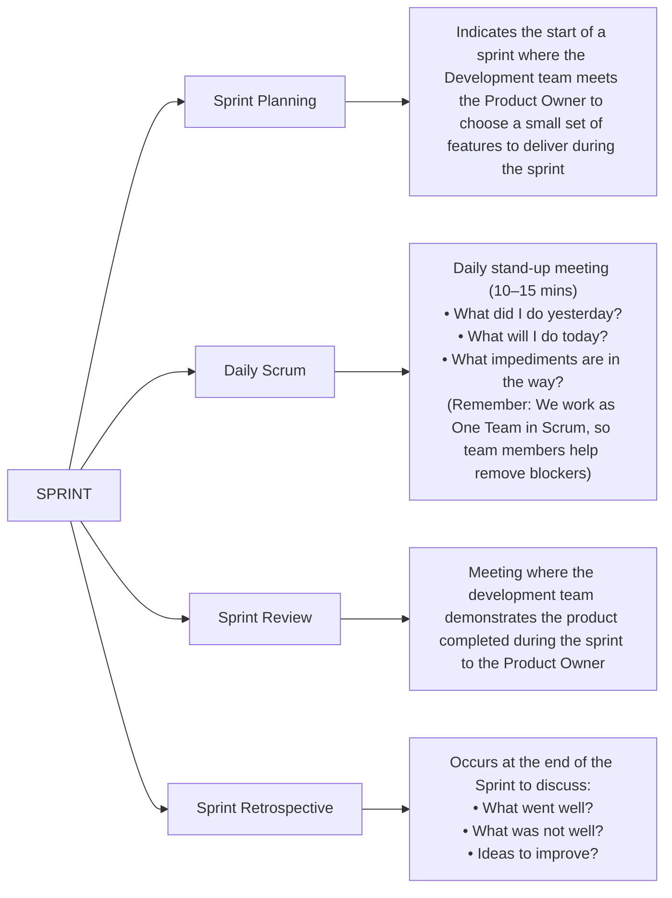
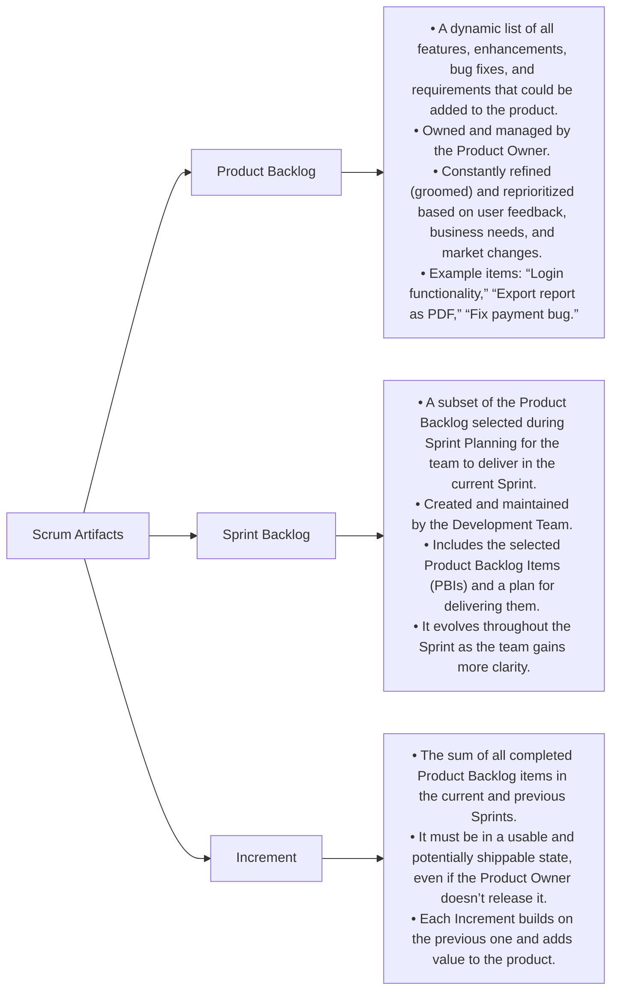

# Agile Terminology

## What is Agile ? 

Agile is a **flexible and iterative approach** to software development where the **team works in small increments** (called **sprints**), continuously collaborating with stakeholders and delivering working software frequently.
  - Focus on Continous Improvement
  - More Customer Involvement
  - Predictable end Product
  - Allows more flexibility (Open to Changes and Addition)

**Key Characteristics:**
- Iterative & Incremental
- Customer Collaboration
- Responding to Change
- Working Software Over Documentation

**Real-Time Example:**
Think of a mobile app development project. Instead of delivering the entire app after 6 months, the team builds and delivers key features (like login, dashboard, profile) every 2 weeks. Stakeholders give feedback on each version, and improvements are made on the go.

**Traditional Model vs Agile:**

  |  Waterfall (Traditional)  |  Agile  |
  |  ----------------------  |  ------  |
  |  Sequential Phases  |  Iterative Sprints  |
  |  Late Customer Feedback  |  Continuous Feedback  |
  |  Changes are costly  |  Easy to adapt changes  |
  |  Full product at the end  |  Working product every sprint  |

---

## Agile Manifesto (Agile Values)
The Agile Manifesto was created in 2001 by 17 software developers. It has 4 core values:

1. **Individuals and Interactions** over processes and tools
2. **Working Software** over comprehensive documentation
3. **Customer Collaboration** over contract negotiation
4. **Responding to Change** over following a plan

This doesn’t mean the items on the right have no value, but the items on the left are valued more.

---

## Principles of Agile

There are 12 Agile Principles:

■ Customer satisfaction by early and continuous delivery.

■ Welcome changing requirements.

■ Deliver working software frequently (weeks rather than months).

■ Business and developers must work together.

■ Build projects around motivated individuals.

■ Face-to-face conversation is best.

■ Working software is the primary measure of progress.

■ Maintain a sustainable pace.

■ Continuous attention to technical excellence.

■ Simplicity is essential.

■ Best architecture emerges from self-organizing teams.

■ Reflect regularly and adjust behavior accordingly.

Memory Tip:

Use the acronym **CWDF**-**BF**-**WWMC**-**SR** for recall:

- C: Customer satisfaction
- W: Welcome change
- D: Deliver software frequently
- F: Face-to-face communication
- B: Business + Devs together
- F: Frequent delivery
- W: Working software
- W: Work sustainably
- M: Maintain excellence
- C: Continuous improvement
- S: Simplicity
- R: Reflect and adjust

--- 

## Agile Team

An Agile Team is cross-functional, self-organizing, and collaborative. They include all roles needed to deliver a working software increment.

**Roles:**

**Product Owner** - Represents the customer, defines features & priorities.

**Scrum Master** - Facilitates the process, removes blockers, ensures scrum is followed.

**Development Team** - Designers, developers, testers working together.

Example Structure:

 | Role | Responsibility  |
 |  ---  |  ---  |
 |  **Product Owner**  |  Defines and prioritizes the backlog  |
 |  **Scrum Master**  |  Guides team, conducts meetings  |
 |  **Developers**  |  Build and test the product increment  |

---

## Scrum Framework

Scrum is the most popular Agile framework.

Scrum Flow Diagram:
[Product Backlog] -> [Sprint Planning] -> [Sprint (2-4 weeks)]
       
            Daily Stand-ups
       
[Increment] <- [Sprint Review & Retrospective]

### Scrum framework ? 
It is an Agile Framework which is both iterative and incremental in nature.
-> Makes progress in a series of iteration (Sprints).
-> Incremental addition of features in each sprint.

Consists of **Scrum Team**, **Events** and **Artifacts**.

**Scrum Team**
| Product Owner | Development Team | Scrum Master |
| ------------| ---- | ---- |
| Customer representative who conveys the customer's vision to the team | Cross functional and self orgranizing | Facilitates with team | 

**Scrum Events**

- **Sprint** - Time-boxed development cycle (usually 2 weeks)
- **Sprint Planning** - Define goals and tasks for the sprint
- **Daily Scrum** - 15 min daily meeting (What did I do? What will I do? Any blockers?)
- **Sprint Review** - Demo the work to stakeholders
- **Sprint Retrospective** - Team discusses what went well/improvements

---

## Scrum Artifacts:

- **Product Backlog:** All features/requirements
- **Sprint Backlog:** Selected items to work on in the sprint
- **Increment:** The working software delivered
  

---

## Agile Testing Quadrants

The Agile Testing Quadrants help organize different types of testing activities.

Quadrant | Purpose | Examples
 --- | --- | ---
Q1 | Support developers | Unit tests, Component tests
Q2 | Support business | Acceptance tests, Story tests
Q3 | Critique product | Exploratory, Usability tests
Q4 | Evaluate product performance | Load, Stress, Security tests

**Real-Time Example:**

For a food delivery app:

- **Q1:** Unit tests for calculating delivery charges
- **Q2:** Acceptance test for "Place Order"
- **Q3:** Manual exploratory testing of new UI
- **Q4:** Load testing for 10,000 users at peak hours

---
